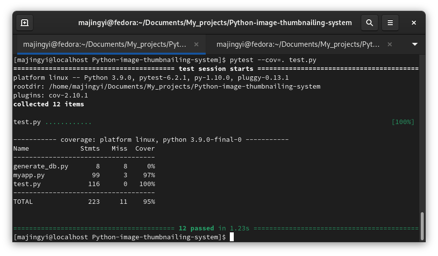

# Python-image-thumbnailing-system

Presentation
------------

* This is a Flask application that provides an API that read uploaded images,
extract its metadata, thumbnails them and make the thumbnail images available
for consumption by the user.

API
---
| Method | Route| Description |
| :------------ | :-------------: | -------------: |
| POST | /images | upload a new image, responds an image ID |
| GET | /images-all |  list all images with their informations|
| GET | /images/&lt;id&gt; |  describe image processing state (pending, success, failure) metadata and links to thumbnail  |
| GET | /thumbnails/&lt;id&gt;.jpg | a way to read the generated thumbnail |

* To upload an image : ```curl -F "image=@<your_image_file>" http://127.0.0.1:5000/images```
* For GET methods : ```curl http://127.0.0.1:5000/images/<route>```

Installation
------------
* flask ```$ pip install flask```
* Pillow ```$ python3 -m pip install --upgrade Pillow```
* Pytest ```$ pip3 install -U pytest"```

Running
-------
* Start the application with ```$ FLASK_APP=myapp.py flask run``` or ```FLASK_APP=myapp.py FLASK_ENV=development flask run```
* Run the test with ```$ pytest test.py```

Check & Reformat
----------------
* Warnings checked with [Pylint](https://www.pylint.org/)
* Reformat with [black](https://github.com/psf/black) & [isort](https://pycqa.github.io/isort/)
* Code coverage checked with [pytest-cov](https://pypi.org/project/pytest-cov/)


